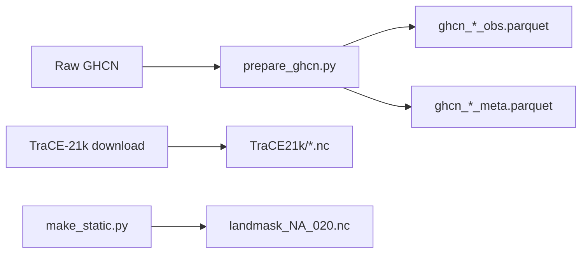

# Input data files

Files that must be **obtained or prepared** before running the production pipeline. Paths are relative to `DATA_DIR`.

## GHCN interim (`GHCN/interim/`)

Produced by `related_scripts/prepare_ghcn.py` from raw GHCN daily files (external; not stored in `DATA_DIR`).

| File | Size | Format | Description | Producer | Consumers |
|------|------|--------|-------------|----------|-----------|
| `ghcn_tas_obs.parquet` | ~15 MB | Parquet | GHCN temperature station observations | `prepare_ghcn.py` | `generate_split.py`, `run_calibrate.py`, `run_cal_pi.py`, `run_project.py`, `run_grid_cal.py`, `F2_data_split.py`, `F4_station_timeseries.py` |
| `ghcn_tas_meta.parquet` | ~1 MB | Parquet | Station metadata (tas) | `prepare_ghcn.py` | `F1_station_coverage.py` |
| `ghcn_pr_obs.parquet` | ~25 MB | Parquet | GHCN precipitation observations | `prepare_ghcn.py` | Same as tas obs (with `pr` variant) |
| `ghcn_pr_meta.parquet` | ~1 MB | Parquet | Station metadata (pr) | `prepare_ghcn.py` | `F1_station_coverage.py` |

**Upstream:** NOAA GHCN daily `.dat` / `.csv` (download separately; see [Setup](setup.md)).

## TraCE-21k (`TraCE21k/`)

CCSM3 TraCE-21k II monthly fields. Downloaded externally; not produced by this repo.

| File | Size | Format | Description | Producer | Consumers |
|------|------|--------|-------------|----------|-----------|
| `TraCE-21K-II.monthly.TREFHT.nc` | ~5 GB | NetCDF | Surface air temperature (ESM) | External download | `run_calibrate.py`, `run_cal_pi.py`, `run_project.py`, `run_grid_cal.py` |
| `TraCE-21K-II.monthly.PRECT.nc` | ~5 GB | NetCDF | Precipitation rate (ESM) | External download | Same scripts (with `pr` variant) |

**Reference:** He & Clark 2022 (TraCE-21k II reanalysis).

## Static (`static/`)

| File | Size | Format | Description | Producer | Consumers |
|------|------|--------|-------------|----------|-----------|
| `landmask_NA_020.nc` | ~200 KB | NetCDF | 0.20° North America land mask (Albers grid) | `make_static.py` | `run_grid_cal.py` |

**Note:** `make_static.py` computes the mask internally; no external raster input required.

## Dependency summary

These inputs feed [produced files](products.md) via the [production scripts](scripts.md).
