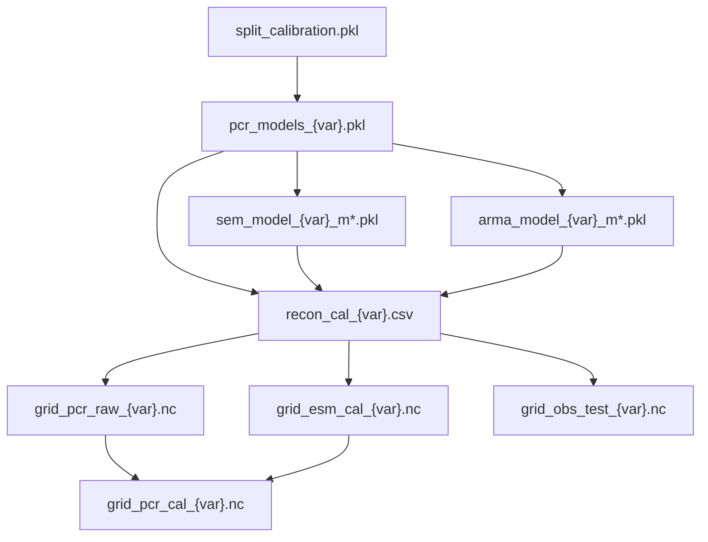

# Produced data files

Pipeline outputs under `DATA_DIR`. Paths use GCM folder `interim/trace21k/` unless noted.

## Models (`interim/trace21k/models/`)

| File | Size | Format | Description | Producer | Consumers |
|------|------|--------|-------------|----------|-----------|
| `split_calibration.pkl` | ~0.5 MB | Pickle | Cal / val / test year split | `generate_split.py` | `run_calibrate.py`, `run_grid_cal.py`, `F2_data_split.py` |
| `pcr_models_tas.pkl` | ~10 MB | Pickle | Trained PCR models, 12 months (tas) | `run_calibrate.py --var tas` | `run_cal_pi.py`, `run_project.py`, `run_grid_cal.py` |
| `pcr_models_pr.pkl` | ~14 MB | Pickle | Trained PCR models, 12 months (pr) | `run_calibrate.py --var pr` | Same (pr variant) |
| `sem_model_tas_m{01..12}.pkl` | ~5 GB total | Pickle | SEM noise models (tas, monthly) | `run_cal_pi.py --var tas` | `run_project.py` |
| `sem_model_pr_m{01..12}.pkl` | ~14 GB total | Pickle | SEM noise models (pr, monthly) | `run_cal_pi.py --var pr` | `run_project.py` |
| `arma_model_tas_m{01..12}.pkl` | ~6 MB total | Pickle | ARMA(1,1) models (tas) | `run_cal_pi.py --var tas` | `run_project.py` |
| `arma_model_pr_m{01..12}.pkl` | ~10 MB total | Pickle | ARMA(1,1) models (pr) | `run_cal_pi.py --var pr` | `run_project.py` |

!!! warning "SEM / ARMA models — regeneratable, not shared"
    The 24 SEM files (~19 GB) are **regeneratable** with `run_cal_pi.py` given PCR models plus GHCN/TraCE inputs. They are **typically not distributed**; regenerate locally to save transfer volume.

## Station calibration (`interim/trace21k/station_cal/`)

| File | Size | Format | Description | Producer | Consumers |
|------|------|--------|-------------|----------|-----------|
| `recon_cal_tas.csv` | ~770 MB | CSV | Station PCR predictions, cal period, monthly (tas) | `run_project.py --var tas --cal-only` | `run_grid_cal.py`, `F4_station_timeseries.py` |
| `recon_cal_pr.csv` | ~1.25 GB | CSV | Station PCR predictions, cal period, monthly (pr) | `run_project.py --var pr --cal-only` | Same (pr variant) |
| `test_cache_tas.parquet` | ~50 MB | Parquet | Cached test-set validation data (tas) | `Paper_Code/main/_build_test_cache.py` | `T1_timestep_metrics.py`, `T2_station_metrics.py`, `T45_mss.py` |
| `test_cache_pr.parquet` | ~80 MB | Parquet | Cached test-set validation data (pr) | `_build_test_cache.py` | Same (pr variant) |

## Grid calibration (`interim/trace21k/grid_cal/`)

| File | Size | Format | Description | Producer | Consumers |
|------|------|--------|-------------|----------|-----------|
| `grid_pcr_raw_tas.nc` | ~308 MB | NetCDF | PCR gridded field, no variance correction (tas) | `run_grid_cal.py --var tas` | `F3_mean_fields.py`, `F5_bias_map_tas.py`, `TC1_vc_eval.py` |
| `grid_pcr_raw_pr.nc` | ~308 MB | NetCDF | PCR gridded field, no variance correction (pr) | `run_grid_cal.py --var pr` | `F3_mean_fields.py`, `F6_bias_map_pr.py`, `TC1_vc_eval.py` |
| `grid_pcr_cal_tas.nc` | ~200 MB | NetCDF | PCR with variance correction (tas) | `run_varcorr_cal.py --var tas` | `TC1_vc_eval.py` only |
| `grid_pcr_cal_pr.nc` | ~199 MB | NetCDF | PCR with variance correction (pr) | `run_varcorr_cal.py --var pr` | `TC1_vc_eval.py` only |
| `grid_esm_cal_tas.nc` | ~30 MB | NetCDF | TraCE-21k regridded to target grid (tas) | `run_grid_cal.py --var tas` | `F3_mean_fields.py`, `F5_bias_map_tas.py`, `run_varcorr_cal.py`, `TC1_vc_eval.py` |
| `grid_esm_cal_pr.nc` | ~33 MB | NetCDF | TraCE-21k regridded to target grid (pr) | `run_grid_cal.py --var pr` | `F3_mean_fields.py`, `F6_bias_map_pr.py`, `run_varcorr_cal.py`, `TC1_vc_eval.py` |
| `grid_obs_test_tas.nc` | ~22 MB | NetCDF | GHCN test stations gridded (tas) | `run_grid_cal.py --var tas` | `F5_bias_map_tas.py`, `TC1_vc_eval.py` |
| `grid_obs_test_pr.nc` | ~23 MB | NetCDF | GHCN test stations gridded (pr) | `run_grid_cal.py --var pr` | `F6_bias_map_pr.py`, `TC1_vc_eval.py` |

!!! note "Variance-corrected grids — produced but not used in final analysis"
    `grid_pcr_cal_*.nc` files are written by Step 5 for **variance-correction evaluation** (`TC1_vc_eval.py`). Main paper figures use **`grid_pcr_raw_*.nc`** instead.

## Full production (`output/trace21k/`)

| Path | Status | Description | Producer |
|------|--------|-------------|----------|
| `predict/` | **Not yet produced** | 3 showcase prediction windows | `run_cal_predict.py` / `run_project.py` |
| `full/` | **Not yet produced** | 22 ka monthly output chunks | `run_project.py` (full run) |

## File dependency chain (produced)

See [Scripts ↔ Data](scripts.md) for the full producer/consumer table.
